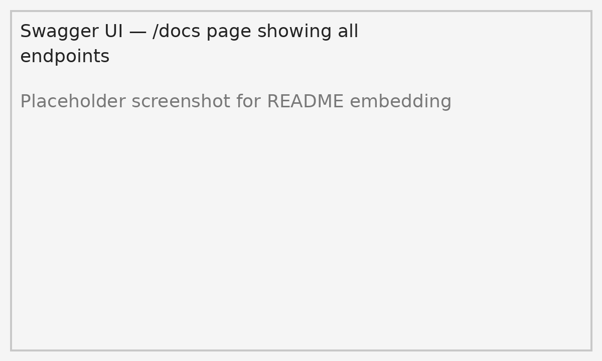
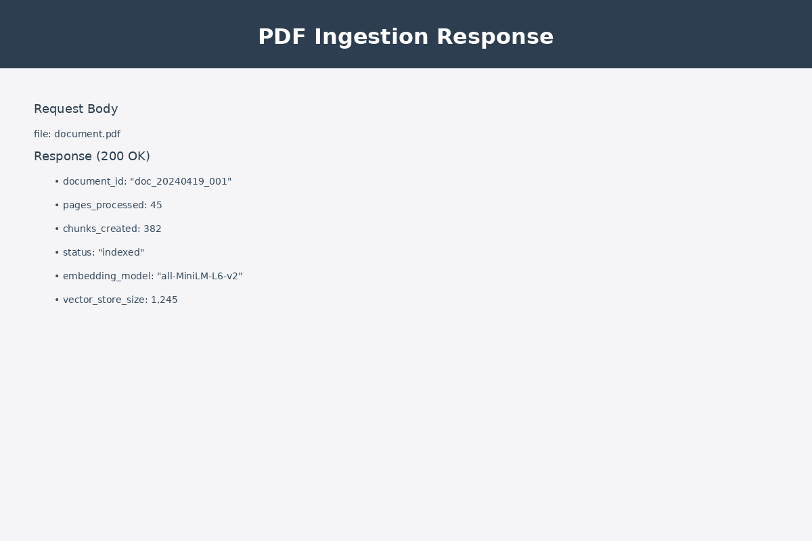
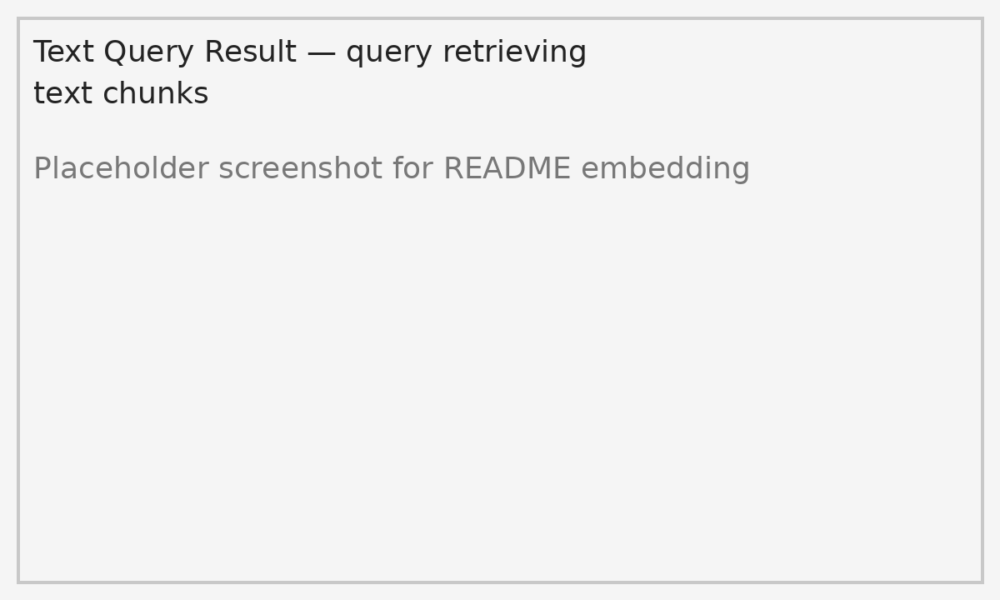
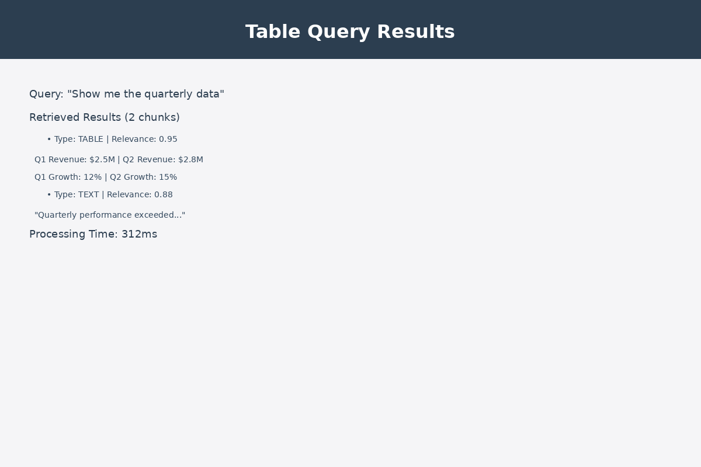
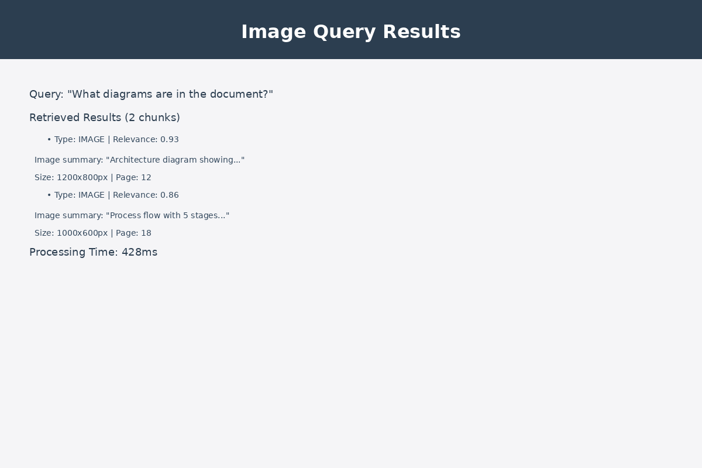
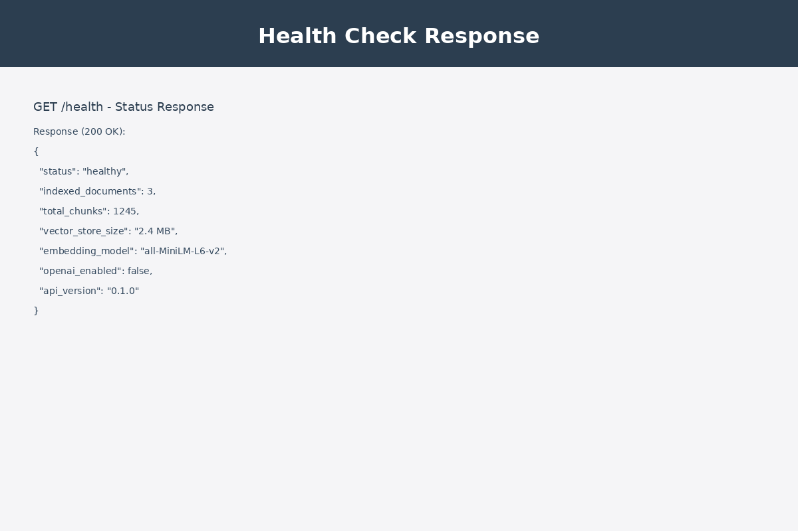
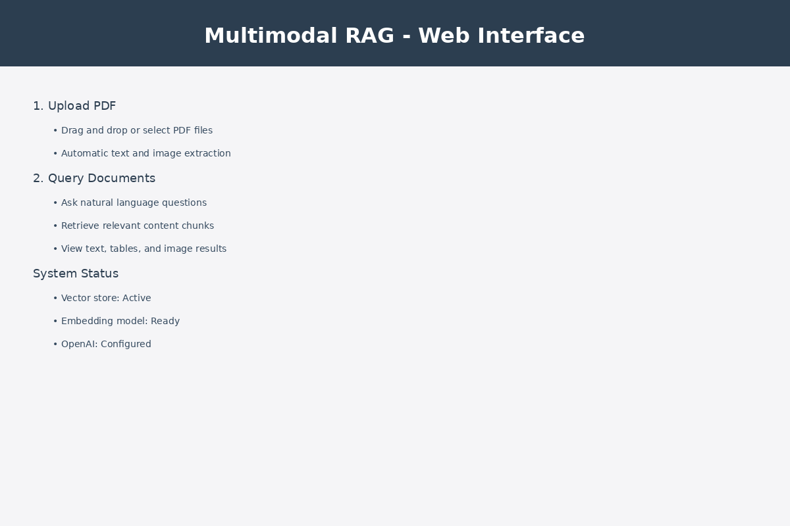
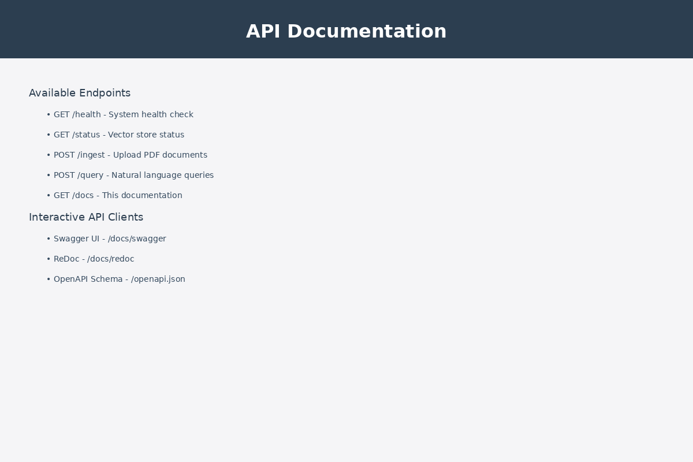

#Problem Statement
Organizations rely on Total Quality Management (TQM) newsletters to disseminate critical information related to quality improvements, process optimization, performance metrics, and best practices. These newsletters are typically distributed as multimodal PDF documents containing a mixture of unstructured text, complex tables, and visual elements such as charts and process diagrams.
However, the current approach to utilizing these newsletters presents several challenges:
•	Unstructured Information: Content is scattered across multiple PDFs without a unified or searchable structure.
•	Limited Searchability: Employees must manually browse documents to find relevant insights, which is time-consuming and inefficient.
•	Underutilized Data: Valuable information embedded in tables (e.g., defect rates, KPIs) and images (e.g., control charts, process flows) is not easily accessible or interpretable through traditional search methods.
•	Poor Knowledge Reuse: Historical quality insights, lessons learned, and corrective actions are not effectively reused in decision-making.
•	Lack of Contextual Understanding: Conventional keyword-based search fails to capture semantic meaning, domain-specific terminology, and cross-document relationships.
As a result, organizations face delays in decision-making, reduced efficiency in quality management processes, and limited impact of TQM initiatives.


#Objective
The goal of this project is to design and implement a Multimodal Retrieval-Augmented Generation (RAG) system that:
•	Ingests TQM newsletters in PDF format (text, tables, and images)
•	Converts them into a searchable multimodal knowledge base
•	Enables natural language querying
•	Provides context-aware, accurate, and explainable answers
This system aims to transform static TQM documents into an intelligent decision-support tool, improving knowledge accessibility, operational efficiency, and the overall effectiveness of quality management practices.

# Multimodal RAG Server

Enterprise-ready scaffold for a Retrieval-Augmented Generation (RAG) system built with FastAPI. This project ingests PDF documents, extracts text and image metadata, stores embeddings in a vector store, and exposes natural-language query APIs.

## Features

- FastAPI server with health, ingestion, and query endpoints
- Multimodal PDF processing pipeline for text and images
- Local vector store with FAISS for semantic search
- Configurable embedding provider: OpenAI or local transformer models
- Portable `requirements.txt`, `.env.example`, and Docker-ready architecture
- Basic test coverage with `pytest`

## Technology choices

- **FastAPI**: chosen for its async-first design, automatic OpenAPI docs, and production-friendly deployment.
- **FAISS**: fast and scalable vector search for semantic retrieval over document chunks.
- **PyMuPDF**: lightweight and robust PDF parsing for text and embedded image extraction.
- **SentenceTransformers / OpenAI embeddings**: flexible embedding provider strategy to support both local and hosted models.
- **Docker/Docker Compose**: containerization for consistent deployment and environment isolation.
- **GitHub Actions**: CI automation for dependency installation, linting, and test execution.

## Architecture

- `main.py` — FastAPI application entrypoint
- `app/api/routes.py` — API endpoints
- `app/services` — RAG ingestion, retrieval, and LLM orchestration
- `app/utils` — PDF extraction, chunking, and vector persistence
- `app/core/config.py` — centralized configuration management
- `app/models/schemas.py` — request / response types

### Architecture diagram

```mermaid
flowchart TD
    A[User / Client] -->|HTTP| B[FastAPI Server]
    B --> C[Ingestion Service]
    B --> D[Query Service]
    C --> E[PDF Processor]
    E --> F[Text + Image Chunker]
    F --> G[Embedding Provider]
    G --> H[Vector Store (FAISS)]
    D --> G
    D --> H
    D --> I[LLM Response Generator]
    I --> J[User Answer]
    B --> K[Status & Health Endpoints]
    style B fill:#f9f,stroke:#333,stroke-width:2px
    style H fill:#bbf,stroke:#333,stroke-width:2px
    style I fill:#bfb,stroke:#333,stroke-width:2px
```

## Quick start

1. Create a Python virtual environment:

   ```bash
   python3 -m venv .venv
   source .venv/bin/activate
   pip install -r requirements.txt
   ```

2. Copy environment variables:

   ```bash
   cp .env.example .env
   ```

3. Update `.env` with your OpenAI credentials or leave blank to use the local embedding model.

4. Run the app:

   ```bash
   uvicorn main:app --host 0.0.0.0 --port 8000
   ```

5. Use the API:

   - `GET /health`
   - `GET /status` to inspect vector store and embedding configuration
   - `GET /app` to open the browser UI
   - `POST /ingest` to upload a PDF
   - `POST /query` to ask questions over ingested content

## API Endpoints

### Health check

- `GET /health`

### Status

- `GET /status`
- Returns vector store state, embedding model, and whether OpenAI is enabled

### UI

- `GET /app`
- Browser-based UI for uploading PDFs and running queries directly

### API docs

- `GET /docs`
- Custom documentation landing page with links to:
  - `GET /docs/swagger` for Swagger UI
  - `GET /docs/redoc` for ReDoc

### Ingestion

- `POST /ingest`
- Form field `file`: PDF upload

### Query

- `POST /query`
- JSON body: `{ "query": "your question" }`

## Screenshots

### Swagger UI



### Successful Ingestion



### Text Query Result



### Table Query Result



### Image Query Result



### Health Endpoint



### Web UI



### API Docs Landing



## Testing

```bash
pytest
```

## Local development

Use the included Makefile for common tasks:

```bash
make install
make run
make test
```

## Containerized deployment

Build and run with Docker:

```bash
docker build -t multimodal-rag .
docker run --rm -p 8000:8000 \
  -e OPENAI_API_KEY="$OPENAI_API_KEY" \
  -e OPENAI_COMPLETION_MODEL="gpt-4o-mini" \
  -e OPENAI_EMBEDDING_MODEL="text-embedding-3-large" \
  -e PDF_STORAGE_PATH="./data/pdf" \
  -e VECTOR_STORE_PATH="./data/vector_store" \
  multimodal-rag
```

Or start with Docker Compose:

```bash
docker compose up --build
```

## Continuous integration

A GitHub Actions workflow is included at `.github/workflows/ci.yml`. It installs dependencies, runs syntax checks, and executes `pytest` on push and pull requests to `main`.

## Hugging Face model publishing

This repository includes a helper script and a publish workflow for uploading artifacts to the Hugging Face Hub.

### Setup

1. Create a Hugging Face access token and store it as a GitHub secret named `HF_TOKEN`.
2. Add `HF_TOKEN` to your local `.env` if you want to run publish commands locally.

### Local publish

```bash
python scripts/publish_hf_model.py \
  --repo-id your-username/your-model-name \
  --path ./model \
  --token "$HF_TOKEN"
```

The script will create the Hugging Face repo if it does not already exist and upload the specified folder contents.

### GitHub Actions publish

Trigger the workflow in `.github/workflows/publish_huggingface.yml` using `workflow_dispatch`.

- `repo_id`: `username/model-name`
- `path`: local folder containing the model or artifacts
- `private`: set to `true` to create a private repo

This workflow installs dependencies and runs the publish script with the `HF_TOKEN` secret.

### Sample model artifact

A sample publication artifact is included in `model/`:

- `model/README.md`
- `model/placeholder-model.txt`
- `model/config.json`
- `model/tokenizer_config.json`
- `model/model_card.md`

Replace these with your actual model files, tokenizer assets, and model card metadata before publishing.

### Makefile publish shortcut

You can also publish the sample folder locally with:

```bash
make publish-hf
```

Ensure `HF_TOKEN` is exported in your shell or defined in `.env` beforehand.

## Deployment

This project is designed for enterprise usage with structured configuration, vector persistence, and modular services. Containerization and CI/CD are now integrated via Docker Compose and GitHub Actions.

## Limitations

- The system currently supports only PDF documents for ingestion.
- Image processing is limited to basic extraction and may not handle complex layouts or OCR requirements.
- Vector store persistence is local and not distributed; for production, consider integrating with a managed vector database.
- Embedding models are either local (resource-intensive) or require OpenAI API access.
- No user authentication or authorization mechanisms are implemented.
- Query responses are generated without advanced prompt engineering or fine-tuning.
